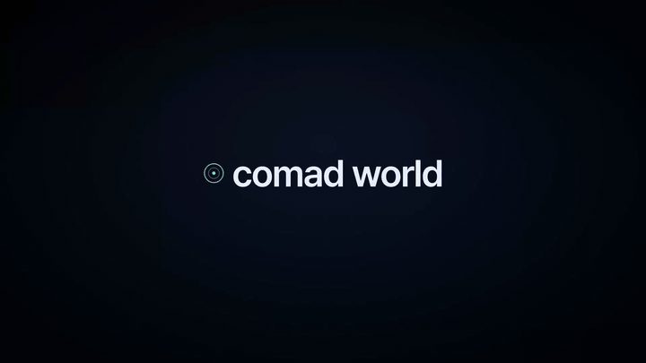

<h1 align="center">Comad World</h1>

<p align="center">
  <strong>You read arXiv every morning. By Friday, you can't remember what Tuesday's paper argued.<br>
  Comad World turns each paper you read into a graph edge, a sharpened retrieval lens, a calibrated prediction.<br>
  Your reading stops evaporating — it compounds into a system that thinks alongside you.</strong>
</p>

<p align="center">
  <a href="LICENSE"></a>
  
  
</p>

<p align="center">
  6 AI agents that <b>crawl → understand → simulate → curate → remember → evolve</b><br>
  Two feedback loops: the system improves itself, and improves your coding.<br>
  Change one YAML file, get a whole new knowledge system.
</p>

<p align="center">
  <a href="#quickstart">Quickstart</a> · <a href="#architecture">Architecture</a> · <a href="#modules">Modules</a> · <a href="#customization">Customization</a> · <a href="#presets">Presets</a>
</p>

<p align="center">
  
</p>

<p align="center">
  <sub>🎬 <a href="docs/promo-v0.3.0.mp4">Full-quality 1920×1080 MP4</a> · <a href="docs/promo-v0.3.0-60fps.mp4">60fps</a> · 30s · 27-angle expert review · Gap Packs A~D</sub>
</p>

---

## What You Get

| | Without Comad World | With Comad World |
|---|---|---|
| **Collecting** | Manually check 20+ sites, forget half | `ear` auto-detects and archives from RSS, HN, arXiv, GitHub |
| **Organizing** | Bookmarks pile up, no connections | `brain` builds a knowledge graph — 10,000+ nodes, searchable via GraphRAG |
| **Analyzing** | Read each article, form opinions alone | `eye` runs simulations through 5 core strategic lenses (tiered system), tracks prediction accuracy |
| **Remembering** | Context lost between sessions | `sleep` consolidates memory, `voice` automates recurring workflows |

<details>
<summary><b>Key numbers from a real deployment</b></summary>

- **60,000+** graph nodes, **150,000+** relationships from ongoing crawling
- **31** RSS feeds monitored (OpenAI, Anthropic, Google, Meta, arXiv, researcher blogs)
- **30+ MCP tools** across 4 servers (brain 21, eye 7, sleep 2, photoshop) — all auto-connected
- **Entity-level confidence scoring** (0.0–1.0) for trust boundary tracking
- **Content guard** — injection detection on all crawled content (10 threat patterns)
- **Built-in performance monitoring** via `comad_brain_perf` MCP tool
- **$0/day** additional cost with Claude Max subscription (all LLM calls via CLI, local Ollama for eye)
- **1,388+** tests across all modules (Brain 200 + Eye 1,188)

</details>

---

## 🌍 What is Comad World?

Comad World is a modular AI agent system built on [Claude Code](https://docs.anthropic.com/en/docs/claude-code). It connects six specialized agents into a pipeline that collects information, builds a knowledge graph, runs simulations, curates content, manages memory, and automates workflows — all driven by a single configuration file.

```
ear (listen) → brain (think) → eye (predict)
                  ↑
photo (edit)    sleep (remember)    voice (automate)
```

**The key idea:** every domain-specific setting lives in `comad.config.yaml`. Swap the config, and the entire system adapts — from what RSS feeds to crawl, to what arXiv categories to watch, to how articles are classified.

---

## Who is this for?

- **Knowledge workers** who want a persistent, queryable memory of what they've read.
- **Developers** building on Claude Code who want an MCP-powered knowledge graph.
- **Domain experts** (AI/ML, finance, biotech, web dev) who need a focused research assistant — swap a YAML preset, the whole stack adapts.

## Quickstart

Prerequisites: [Claude Code](https://docs.anthropic.com/en/docs/claude-code), [Docker](https://docker.com/), [Bun](https://bun.sh/), [Python 3.13+](https://python.org/).

```bash
git clone https://github.com/kinkos1234/comad-world.git && cd comad-world
cp presets/ai-ml.yaml comad.config.yaml   # or web-dev / finance / biotech
./install.sh                               # deps + Neo4j schema
cd brain && bun run setup && bun run mcp   # start MCP server
zsh brain/scripts/schedule-install.sh      # OS-aware scheduler (below)
```

### Scheduled jobs (cross-platform)

| OS | Scheduler | Why |
|---|---|---|
| macOS | LaunchAgents (`gui/<uid>`) | cron runs outside Aqua → keychain-locked; LaunchAgents inherit the GUI session. |
| Linux / WSL | cron | Session keychain propagates. |
| Windows | Task Scheduler (`LogonType=Interactive`) | DPAPI/OAuth stays unlocked while logged on. Uses bun directly — no shell. |

All three reuse the existing Claude Max OAuth — no extra API key. Per-platform install details: `brain/scripts/launchd/README.md`.

Full catalog of the 11 scheduled jobs (dependencies, cron expressions, missing-run recovery) lives in [`docs/cron-catalog.md`](docs/cron-catalog.md). A boot-time catch-up agent (`com.comad.cron-catchup`) replays any LaunchAgent that would have fired while the laptop was asleep, so the Monday analysis pipeline still runs even if you opened the lid mid-day.

### Upgrading

Already have Comad World installed? After `./install.sh` you get a `comad` command on your PATH (symlink into `~/.local/bin/`) plus a root `Makefile` with matching shortcuts:

```bash
comad status          # show VERSION + module SHAs (any module dirty?)
comad upgrade         # full upgrade — main repo + 6 modules + deps + agents
comad upgrade --dry-run   # preview what would change (no writes)
comad backups         # list snapshots created by previous upgrades
comad rollback <ts>   # restore an earlier snapshot
comad lock            # regenerate comad.lock from current SHAs
comad help

# Makefile equivalents
make status
make upgrade
make upgrade-check          # = comad upgrade --dry-run
make backups
make rollback TS=<ts>
make test                   # full suite (brain + eye)
make clean                  # dry-run: preview runtime artifacts to remove
make clean-apply            # actually remove caches, logs, build artifacts
make clean-deep             # also nuke node_modules / .venv (slow, ~3.6 GB)
make render                 # regenerate path-aware templates
make validate-config        # check comad.config.yaml + presets against the schema
```

Configuration rules are documented in [ADR 0002 — `comad.config.yaml` Contract](docs/adr/0002-config-contract.md). The canonical JSON Schema lives at `schema/comad.config.schema.json` and is validated by the `config-schema-validation` CI job on every push.

Repository strategy is documented in [ADR 0001 — Repository Strategy](docs/adr/0001-repository-strategy.md). The short version: the umbrella owns the wiring (installer, scripts, `Makefile`, `VERSION`, `comad.lock`, `docs/`), each module directory is owned by its own nested `.git`, and `comad.lock` pins the combination. A `Structure Guard` CI job rejects PRs that duplicate module files at the root or track build artifacts.

If you installed Comad World before the `comad` command existed, bootstrap it once:

```bash
cd /path/to/comad-world
git pull origin main                                      # pull upgrade.sh + scripts/comad
ln -s "$(pwd)/scripts/comad" "$HOME/.local/bin/comad"     # or re-run ./install.sh
export PATH="$HOME/.local/bin:$PATH"                      # if not already on PATH
comad upgrade --dry-run
```

The underlying script (`scripts/upgrade.sh`) is always available too:

```bash
./scripts/upgrade.sh --dry-run
./scripts/upgrade.sh --rollback <ts>
```

What it does:

1. **Pre-flight** — refuses to run on a dirty working tree (use `--force` to override); warns about running Comad services (ports 3000/8000/7687/7688); diffs new `.env.example` keys against your `.env`.
2. **Snapshot** — copies `comad.config.yaml`, `comad.lock`, `VERSION`, `.env`, and `~/.claude/agents/` into `.comad/backups/<timestamp>/`.
3. **Pull** — fast-forwards the main repo and each of the six module repos (brain / ear / eye / photo / sleep / voice) on their tracked branch, recording per-module result + elapsed time.
4. **Dependencies** — reruns `bun install` (brain), `pip install -r eye/requirements.txt`, and `npm ci` (eye/frontend) as applicable.
5. **Agents & configs** — redeploys `comad-sleep` and `comad-photo` agents, replaces the `COMAD-VOICE` section of `~/.claude/CLAUDE.md` in place, and reruns `scripts/apply-config.sh` to regenerate module configs from `comad.config.yaml`.
6. **Summary** — per-module success/failure table, CHANGELOG excerpt since the previous `VERSION`, and updated `comad.lock`.

The version contract is `VERSION` (root) + `comad.lock` (pins every module SHA). GitHub Actions runs `scripts/upgrade.sh --dry-run --force` on every PR that touches the upgrader, so the happy path stays green.

If you want to pin your install to a known-good combination, commit `comad.lock` and treat it like `package-lock.json`.

### Where can I clone the repo?

Anywhere. The repo is path-agnostic — pick any folder, any name:

```bash
git clone https://github.com/kinkos1234/comad-world.git ~/Desktop/my-agents
cd ~/Desktop/my-agents && ./install.sh
comad status   # shows the new path
```

`scripts/comad` follows its own symlink (`~/.local/bin/comad`) to derive the repo root. `scripts/upgrade.sh` uses `BASH_SOURCE`, `brain/scripts/launchd/install.sh` uses `${0:A:h}`, and `scripts/render-templates.sh` rewrites `{{COMAD_ROOT}}` placeholders in `*.example` files (currently `sleep/.mcp.json.example`) into per-machine absolute paths at install/upgrade time. There are no `/Users/<author>` hardcodes left.

---

## Demo: Swap a Preset, Change Everything

```bash
# Start with AI/ML preset
$ head -5 comad.config.yaml
profile:
  name: "Comad AI Lab"
  language: "en"
  description: "AI/ML knowledge system"

# Crawl AI sources (31 RSS feeds, 10 arXiv categories)
$ cd brain && bun run crawl:hn
[hn-crawler] Keywords: 48, RSS feeds: 22, HN queries: 8
[hn-crawler] HN stories: 347
[hn-crawler] RSS results: 412
[hn-crawler] Wrote 583 articles to data/articles-crawl.json

# Now switch to Finance
$ cp presets/finance.yaml comad.config.yaml
$ ./scripts/apply-config.sh
  ✓ ear/interests.md
  ✓ ear/CLAUDE.md

# Same crawl command, completely different sources
$ bun run crawl:hn
[hn-crawler] Keywords: 31, RSS feeds: 10, HN queries: 7
[hn-crawler] HN stories: 89
[hn-crawler] RSS results: 156
[hn-crawler] Wrote 201 articles to data/articles-crawl.json

# ear/interests.md automatically updated:
$ head -6 ear/interests.md
# User Interest Profile
## High Priority (Core Focus)
- Quantitative Finance (QuantConnect, Zipline, Backtrader)
- Market Data / Analysis
- DeFi / Crypto
- Risk Management
```

One YAML change. Different feeds, different keywords, different categories, different relevance criteria.

---

## Architecture

```
┌─────────────────────────────────────────────────────┐
│                  comad.config.yaml                   │
│  (interests, sources, keywords, categories, stack)   │
└───────────┬───────────┬───────────┬─────────────────┘
            │           │           │
    ┌───────▼──┐  ┌─────▼────┐  ┌──▼──────┐
    │   ear    │  │  brain   │  │  eye    │
    │ (curate) │→ │ (graph)  │→ │(predict)│
    └──────────┘  └──────────┘  └─────────┘
                       │
    ┌──────────┐  ┌────▼─────┐  ┌─────────┐
    │  photo   │  │  sleep   │  │  voice  │
    │  (edit)  │  │(remember)│  │(automate│
    └──────────┘  └──────────┘  └─────────┘
```

### Data Flow

All modules are accessible via natural language — no slash commands needed. 4 MCP servers auto-connect on session start.

1. **Ear** detects articles in Discord, classifies relevance using your interests, archives to markdown
2. **Brain** crawls RSS/arXiv/GitHub filtered by your keywords, builds a Neo4j knowledge graph with entities and relationships. Content guard scans all crawled data. JS-heavy pages automatically rendered via **Browse**
3. **Eye** takes any text, converts to ontology, runs multi-round simulations, generates analysis through 5 core strategic lenses with prediction tracking (7 MCP tools)
4. **Photo** corrects images via Photoshop MCP — auto-launches Photoshop when needed (domain-agnostic)
5. **Sleep** consolidates Claude Code memory across all projects (domain-agnostic)
6. **Voice** provides workflow automation triggers for Claude Code (domain-agnostic)
7. **Search** discovers repos across GitHub/npm/PyPI/arXiv, evaluates them, generates adoption plans, tests in sandbox — the system improves itself

### What's Config-Driven vs. Domain-Agnostic

| Module | Config-Driven | Domain-Agnostic |
|--------|:---:|:---:|
| **ear** | interests, categories, must-read stack, relevance thresholds | archive format, Discord integration, digest generation |
| **brain** | RSS feeds, HN queries, arXiv categories, GitHub topics, entity extraction prompts | Neo4j schema, GraphRAG, MCP tools, MetaEdge engine |
| **eye** | — | entire engine: ontology, simulation, 5 tiered lenses, prediction tracking |
| **photo** | — | everything (works with any photo) |
| **sleep** | — | everything (manages any Claude Code memory) |
| **voice** | — | everything (workflow triggers are generic) |

---

## Modules

### Brain — Knowledge Graph & GraphRAG

Neo4j-based knowledge graph that crawls, extracts entities, and answers questions via MCP.

- **20+ MCP tools** for querying, searching, and analyzing the graph
- **Dual-retriever GraphRAG** — Local + Global + Temporal 3-way search. Benchmark (50 questions): **93% entity recall, 93% grounding rate, 13.8s p50 latency**
- **Graph-driven query expansion** — concept keywords (hallucination, agent, GPU, …) expanded via Neo4j co-occurrence + static fallback; 1h LRU cache
- **Grounded synthesis** — every cited entity is verified to exist in the graph (hallucination-resistant answer metric)
- **MetaEdge engine** — 10 rules for automated relationship inference
- **Entity & claim confidence** — every node scored 0.0–1.0 (explicit mention=0.9+, inferred=0.6–0.8, uncertain=0.3–0.5)
- **Claim tracking** — fact/opinion/prediction with confidence scores, decay, and timelines
- **Performance monitoring** — latency tracking for all MCP tools, GraphRAG pipeline, and crawlers
- **Community detection** — hierarchical clustering for topic discovery
- **Content guard** — prompt injection detection on all crawled content (10 threat patterns + invisible Unicode scanning)
- **Config-driven crawlers** — RSS, arXiv, GitHub crawlers load sources from `comad.config.yaml`

```bash
cd brain
bun install && bun run setup
bun run mcp  # Start MCP server
```

### Ear — Content Curator

Discord bot that detects articles, classifies relevance, and archives with structured metadata.

- **3-tier relevance**: Must-Read (~15%) → Recommended (~65%) → Reference (~20%)
- **Configurable categories** from `comad.config.yaml`
- **Daily digest** auto-generation in HTML — nightly cron writes `ear/digests/YYYY-MM-DD-digest.html`
- **Auto-ingest to /search** — must-read articles in core categories (AI/LLM, Tool, OpenSource, …) are fed into the search pipeline daily, closing the loop ear → brain → /search → adoption
- **YAML frontmatter** for every archived article
- **Two operation modes** — Mode A (interactive `ccd`, real-time, terminal-bound) or Mode B (`ear-poll` LaunchAgent, 15-min REST polling, 24/7, zero IDENTIFY quota). See [guide](https://kinkos1234.github.io/comad/guide/ear.html).

### Eye — Prediction Simulation Engine

Ontology-based simulation that converts text to knowledge graph and runs multi-round impact analysis.

- **6 analytical spaces**: hierarchy, temporal, recursive, structural, causal, cross-space
- **Tiered lens system**: 5 core (Sun Tzu, Adam Smith, Taleb, Kahneman, Meadows) + 2 optional (Clausewitz, Darwin) + 3 legacy
- **Prediction tracking**: closed-loop learning — records predictions with verification deadlines, measures accuracy over time
- **Full pipeline**: ingestion → graph → community → simulation → analysis → report
- **7 MCP tools**: analyze, preflight, Q&A, jobs, report, lenses, status — all callable via natural language
- **Web UI**: FastAPI backend + Next.js frontend
- **AI-readable pages**: server-side rendered report/analysis content, per-page OG + JSON-LD metadata, explicit `robots.txt` allow for GPTBot / ClaudeBot / PerplexityBot / Google-Extended — paste a report URL into any AI and it can read and summarize it without browser tools

```bash
cd eye
pip install -r requirements.txt
make dev  # API (port 8000) + Frontend (port 3000)
```

### Photo — AI Photo Correction

Claude Code agent for photo editing via Photoshop MCP. Auto-launches Photoshop when needed.

- **Auto-launch**: detects Photoshop state, opens via computer-use if not running
- **Non-destructive** editing with backup
- **PIL → Camera Raw → Advanced** priority chain
- **Over-correction guard**: MAE > 20 triggers parameter reduction
- No domain-specific config needed

### Sleep — Memory Consolidation

Agent that cleans up Claude Code auto-memory files across all projects.

- **Merge duplicates**, prune stale refs, clean transient notes
- **Backup first** — timestamped backup with verification before any changes
- **Dry-run mode** — preview without writing
- Trigger: say `dream` in Claude Code

```bash
# Install
cp sleep/comad-sleep.md ~/.claude/agents/
```

### Voice — Workflow Automation

Claude Code harness with auto-triggered workflows.

- **6 triggers**: onboarding, review, full-cycle, parallel detection, repo polish, session save
- **Review Army**: 5 parallel specialist reviewers with adaptive gating
- **Browser QA**: headless testing for navigation, forms, responsive, performance
- **Zero dependencies** — pure markdown/bash
- **Non-developer friendly** — "just say what you want"

```bash
# Install
cd voice && ./install.sh
```

### Browse — Headless Browser (token-efficient)

Playwright Chromium wrapper tuned for AI agents. Anti-bot stealth, CLI + HTTP daemon + programmatic API, 23 commands plus 4 dormant ones.

- **@ref interaction**: `snapshot -i` and `find` hand back stable `@e1`, `@e2`... refs instead of long CSS selectors — keeps transcripts compact
- **Semantic `find`**: filter by `role`/`text`/`label`/`placeholder`/`testid` — refs only, no full snapshot
- **`batch` stdin JSON**: run N steps (goto → find → fill → click → wait) in one HTTP round-trip
- **Session persistence**: `--session <name>` auto-saves/loads Playwright `storageState` (cookies, localStorage, IndexedDB) at `.comad/sessions/<name>.json`
- **Multi-tab**: stable IDs (`t1`, `t2`, …) via `tab list|new|switch|close`
- **Advanced waits**: `wait selector|text|url|load_state|js` + configurable timeout
- **Anti-bot stealth**: UA masking, WebDriver flag removal, realistic plugins
- **Auto-fallback**: brain's content-fetcher uses it when native HTTP returns too little
- **Dormant features** (implement-ready, off by default — enable with `browse feature enable name=<feat>`):
  - `diff` — snapshot/screenshot baseline compare
  - `har` — request/response buffering + export
  - `auth` — AES-256-GCM credential vault + auto-login
  - `route` — network block/mock rules

```bash
cd browse && bun install
bun run src/cli.ts goto https://example.com
bun run src/cli.ts find role=button text=Submit   # refs only, no snapshot
bun run src/cli.ts --session myapp goto https://app.example.com  # persist login

# Batch a login flow in one round-trip
echo '{"steps":[
  {"command":"goto","args":{"url":"https://app.example.com/login"}},
  {"command":"find","args":{"role":"textbox","placeholder":"email"}},
  {"command":"fill","args":{"selector":"@e1","value":"me@example.com"}},
  {"command":"find","args":{"role":"button","text":"Sign in"}},
  {"command":"click","args":{"selector":"@e2"}},
  {"command":"wait","args":{"url":"**/dashboard","timeout":10000}}
]}' | bun run src/cli.ts batch -
```

### loopy-era — Always-On Self-Evolution Harness

Three LaunchAgents that keep the system measuring, learning, and pruning itself without any user prompt.

- **`com.comad.loopy-era`** — supervisor.py runs a 15-phase tick every 30 minutes; phase 04 promotes T6 patterns into `kb_facts`, phase 15 records a composite score row to `results.tsv`
- **`com.comad.kb-sleep`** — every 2h: extracts new facts from all `~/.claude/projects/*/memory/*.md`, refreshes Ollama embeddings, runs rule-only consolidation, and publishes the meta-changelog to GitHub Pages
- **`com.comad.auto-dream`** — daily 03:15 KST: if `dream_pending=true` (memory ≥ 3,500 lines OR ≥ 7 days since last dream), invokes the comad-sleep agent via headless `claude -p` (mutex-guarded against `ccd`/`cdx`)
- **Single SoT for Claude + Codex** — same 5 `comad_kb_*` MCP tools registered in `comad-brain` server, used identically from `claude`, `ccc`, `ccd`, `cdx`
- **Live changelog** — every tick publishes meta-only stats (no body content) to <https://kinkos1234.github.io/memory-log/>
- **Zero new dependencies** — Python stdlib + local Ollama only

```bash
# Install (interactive prompt during install.sh)
./install.sh
# answer "y" to:  Install always-on loopy-era harness (3 LaunchAgents)?

# Manual operations
loopy-era/bin/supervisor.py status
loopy-era/bin/start-harness.sh tick
loopy-era/bin/kb-sleep-tick.py --no-push
```

### Search — Self-Evolving Reference Discovery

GitHub repo discovery → evaluation → adoption planning → sandbox testing. The system finds patterns to improve itself.

- **Multi-source search**: GitHub, npm, PyPI, and arXiv (papers with code) searched in parallel
- **3-axis evaluation**: trust (stars/forks/activity), quality (tests/CI/README), relevance (config-driven keywords from `comad.config.yaml`)
- **Off-topic adoption gate**: hard filter against unrelated domains (genome/finance/game/physics/…) + required overlap with the comad stack (knowledge graph, MCP, Neo4j, agent, LLM, RAG, …)
- **Neo4j graph storage**: reference cards stored as graph nodes for cross-referencing with brain entities
- **Adoption planning**: maps discovered patterns to concrete file changes with risk assessment
- **Sandbox testing**: git worktree isolation for safe verification. `bun install` + `tsc --noEmit` + `bun test` with automatic retry on transient failure
- **Plan cache**: `--apply N` calls reuse prior `searchAndPlan` output (SHA1-keyed, 1h TTL) so repeated adoption of the same query doesn't re-hit external APIs
- **Self-supervised learning**: git survival analysis tracks whether adopted patterns survive or get reverted
- **Ear → /search feed**: nightly cron reads new must-read articles, extracts tech tokens from title+summary, and runs them through the search pipeline
- **Weekly CRON**: automatic PUSH mode diagnosis every Monday
- **8 anti-signals**: marketing README, no license, abandoned repos, star manipulation, off-topic domain, missing core-stack match, missing getting-started section, imbalanced star/issue ratio

```bash
cd brain
bun run packages/search/src/cli.ts "knowledge graph MCP"            # search
bun run packages/search/src/cli.ts "RAG pipeline" --plan             # + adoption plans
bun run packages/search/src/cli.ts "MCP server" --apply 1 --dry-run  # sandbox preview
bun run packages/search/src/cli.ts --stats                           # health dashboard
```

---

## Customization

### Quick: Use a Preset

```bash
cp presets/ai-ml.yaml comad.config.yaml     # AI / Machine Learning
cp presets/web-dev.yaml comad.config.yaml    # Web Development
cp presets/finance.yaml comad.config.yaml    # Finance / Fintech
cp presets/biotech.yaml comad.config.yaml    # Biotech / Life Sciences
```

### Custom: Edit comad.config.yaml

The config has 5 sections. Minimal shape (see `presets/*.yaml` for full examples):

```yaml
interests:
  high:   [{ name: "Core Topic", keywords: ["k1", "k2"] }]
  medium: [{ name: "Secondary",  keywords: ["k3"] }]
  low:    [{ name: "Filter Out", keywords: ["noise"] }]
sources:
  rss_feeds: [{ name: "Blog", url: "https://example.com/feed.xml" }]
  arxiv:     [{ category: "cs.CL", keywords: ["term"], max_results: 500 }]
  github:    { topics: ["mcp"], search_queries: ["knowledge graph"] }
categories: ["AI/LLM", "Tool", "OpenSource"]
must_read_stack: ["Claude Code", "Neo4j", "Bun"]
brain:
  entity_extraction:
    domain_hint: "one sentence describing your domain"
    relationship_types: ["USES_TECHNOLOGY", "COMPETES_WITH"]
```

- **`interests`** drives ear relevance + brain filtering.
- **`sources`** drives brain crawlers.
- **`categories`** drives ear tagging; **`must_read_stack`** drives ear priority.
- **`brain.entity_extraction`** drives knowledge modeling in brain.

### Create Your Own Preset

1. Copy an existing preset: `cp presets/ai-ml.yaml presets/my-domain.yaml`
2. Edit all sections to match your domain
3. Copy to root: `cp presets/my-domain.yaml comad.config.yaml`
4. Run `./scripts/apply-config.sh` to regenerate module configs

---

## Presets

| Preset | Domain | RSS Feeds | arXiv Categories | GitHub Topics |
|--------|--------|:---------:|:----------------:|:-------------:|
| `ai-ml.yaml` | AI / Machine Learning | 22 | 10 | 20 |
| `web-dev.yaml` | Web Development | 15 | — | 15 |
| `finance.yaml` | Finance / Fintech | 10 | 6 | 10 |
| `biotech.yaml` | Biotech / Life Sciences | 8 | 5 | 10 |

Want to add a preset? PRs welcome.

---

## Project Structure

```
comad-world/
├── comad.config.yaml        # YOUR config (edit this)
├── presets/                  # Ready-made domain configs
│   ├── ai-ml.yaml
│   ├── web-dev.yaml
│   ├── finance.yaml
│   └── biotech.yaml
├── brain/                   # Knowledge graph (Bun/TypeScript)
│   ├── packages/
│   │   ├── core/            # Neo4j client, entity extraction, MetaEdge
│   │   ├── crawler/         # RSS, arXiv, GitHub crawlers (config-driven)
│   │   ├── graphrag/        # Dual-retriever search engine
│   │   ├── ingester/        # Content importer
│   │   ├── mcp-server/      # 20+ MCP tools
│   │   ├── search/          # Self-evolving reference discovery
│   │   └── explorer/        # Interactive graph visualization (D3.js)
│   ├── docker-compose.yml
│   └── package.json
├── ear/                     # Content curator (Claude Code agent)
│   ├── archive/             # Archived articles (YAML frontmatter)
│   ├── digests/             # Daily digest HTML
│   └── templates/           # CLAUDE.md + interests.md templates
├── eye/                     # Simulation engine (Python/FastAPI/Next.js)
│   ├── api/                 # FastAPI backend
│   ├── frontend/            # Next.js web UI
│   ├── config/              # Engine settings
│   └── ontology/            # Domain-agnostic ontology schema
├── photo/                   # Photo correction agent
├── sleep/                   # Memory consolidation agent
├── voice/                   # Workflow automation harness
├── scripts/                 # Utility scripts
│   └── apply-config.sh      # Generate module configs from comad.config.yaml
├── install.sh               # One-command setup
└── docker-compose.yml       # Full stack (Neo4j x2 + Ollama)
```

---

## Requirements

| Component | Required | Optional |
|-----------|:--------:|:--------:|
| Claude Code | Yes | — |
| Docker | Yes (for Neo4j) | — |
| Bun | Yes (for brain) | — |
| Python 3.13+ | For eye module | — |
| Ollama | For eye (local LLM) | — |
| Adobe Photoshop | For photo module | — |
| Discord bot | For ear module | — |
| Codex CLI + tmux | For voice parallel work | — |

---

## FAQ

**Q: Do I need all modules?**
No. Each module works independently. Start with `brain` + `ear` for knowledge collection, add others as needed.

**Q: Can I add my own RSS feeds?**
Yes. Edit `sources.rss_feeds` in `comad.config.yaml` and re-run `./scripts/apply-config.sh`.

**Q: Is this only for tech topics?**
No. The `finance` and `biotech` presets demonstrate non-tech usage. The system adapts to any domain where there are RSS feeds, papers, and GitHub repos to crawl.

**Q: How much does it cost to run?**
With Claude Max subscription, additional cost is $0/day. Brain uses `claude -p --model haiku` (included in Max). Eye uses local Ollama (free). No external API calls.

**Q: Can I contribute a preset for my domain?**
Yes! See [CONTRIBUTING.md](CONTRIBUTING.md).

---

## Credits

Built with [Claude Code](https://docs.anthropic.com/en/docs/claude-code) and the [Model Context Protocol](https://modelcontextprotocol.io/).

## Changelog

See [CHANGELOG.md](CHANGELOG.md) for all notable changes.

## License

[MIT](LICENSE)
