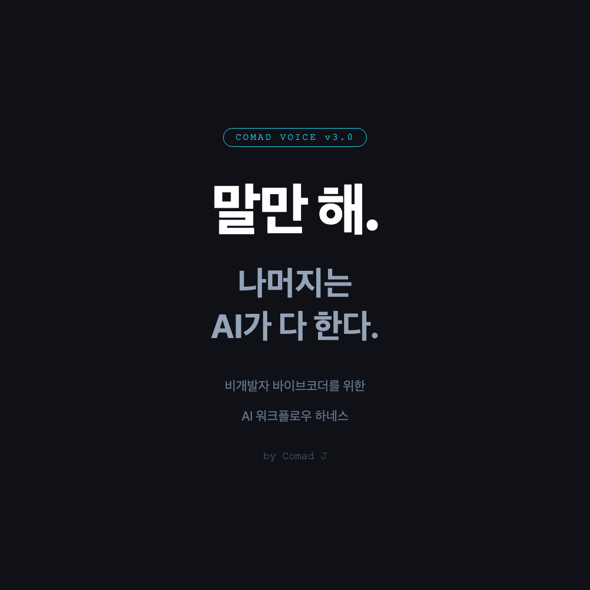
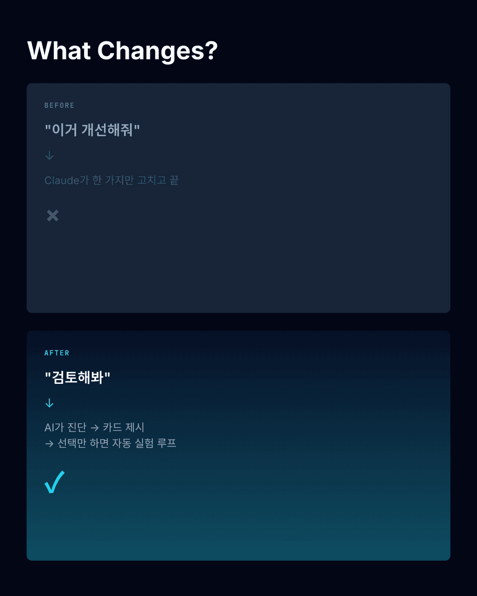
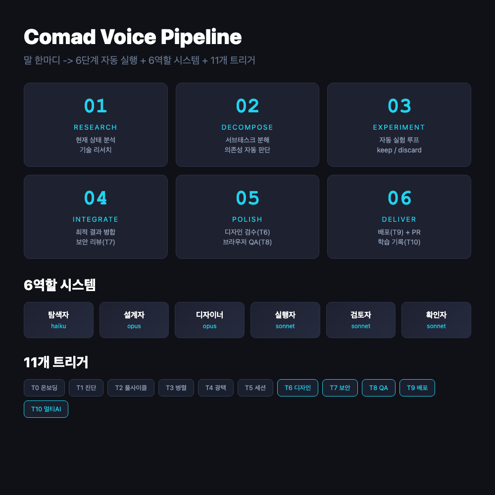
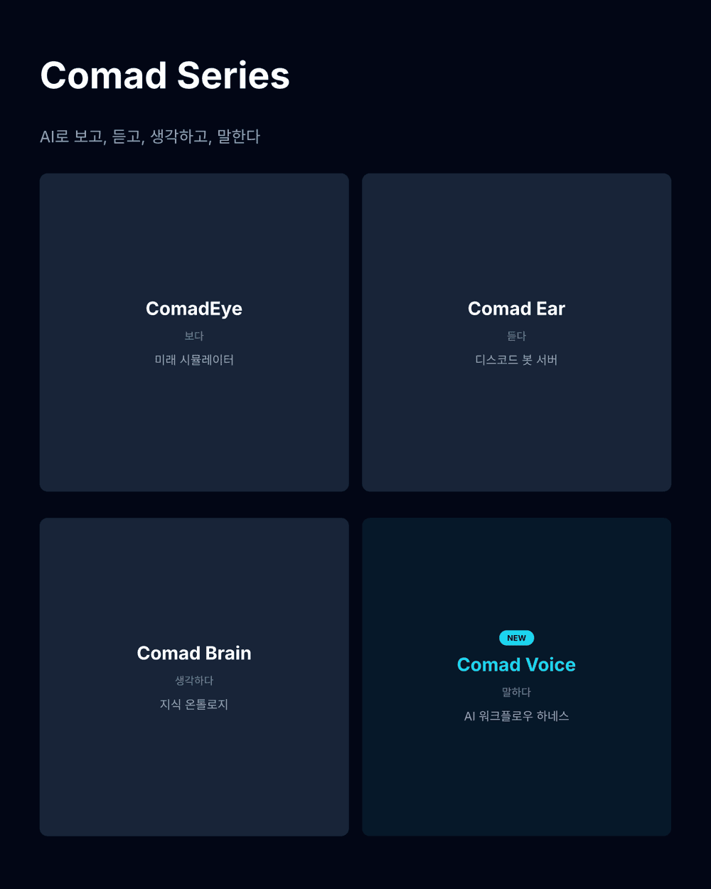

# Comad Voice — 쓰레드 포스트 초안

> 플랫폼: X (Twitter) / Threads / 바이브코더 커뮤니티
> 이미지: 각 슬라이드에 맞는 캡쳐/다이어그램 첨부

---

## 1/9 — Hook

나는 개발자가 아니다.
그런데 Claude Max + ChatGPT Plus + Google Pro를 동시에 결제하고 있다.

문제는: 다 합쳐서 하루에 토큰의 10%도 못 쓰고 있었다.

"뭘 시켜야 할지 모르겠어서."

GitHub: https://github.com/kinkos1234/comad-voice



---

## 2/9 — 문제 정의

바이브코딩의 현실:

"이거 고쳐줘" → AI가 한 줄 고침 → 끝
"개선해줘" → 뭘 개선? → 막막

비개발자에게 AI는 "시키면 하는 도구"인데,
뭘 시켜야 하는지를 모르니까 도구가 놀고 있다.

Karpathy가 말했다:
"AI 시대의 소프트웨어는 Generation + Verification 루프다."

루프를 자동으로 돌리는 시스템이 필요했다.

---

## 3/9 — 해결: Comad Voice

그래서 만들었다.

**Comad Voice** — "말만 해. 나머지는 AI가 다 한다."

Claude Code에 설정 하나 추가하면,
"검토해봐" 한마디로 이런 일이 벌어진다:

1. AI가 코드베이스를 알아서 분석
2. 개선 가능한 영역을 카드로 보여줌
3. 번호만 고르면 자동 실험 루프



---

## 4/9 — 카드 시스템

"검토해봐" 하면 이런 카드가 나온다:

```
카드 1: 추출 정확도 — 난이도 중 / 효과 높음
카드 2: 리포트 서사 — 난이도 낮 / 효과 높음
카드 3: 시각화 추가 — 난이도 높 / 효과 중
```

"2번" 하면 자동으로 실험 시작.
"전부 다" 하면 6단계 파이프라인이 돌아간다.

전문 지식 없이, 선택만 하면 된다.

---

## 5/9 — 풀사이클 파이프라인

대주제 하나 던지면 6단계가 자동 실행:

```
RESEARCH    → 현재 상태 분석 + 기술 리서치
DECOMPOSE   → 서브태스크 분해 + 의존성 자동 판단
EXPERIMENT  → 각 태스크별 실험 루프
INTEGRATE   → 최적 결과 병합 + 리팩토링
POLISH      → QA + 성능 + 문서화
DELIVER     → PR 생성 + 회고
```

의존성 판단도 AI가 알아서 한다.
독립적인 작업은 Codex에 자동 위임.



---

## 6/9 — 멀티 AI 오케스트레이션

Claude만 쓰는 게 아니다.

- **Claude (Opus)**: 총괄 + 핵심 구현
- **Codex**: 독립 모듈 병렬 구현
- **Gemini**: 대규모 리서치

비개발자가 "이건 독립적이야, 저건 의존적이야"를
판단할 필요 없다. 5가지 체크리스트로 AI가 자동 분류:

1. 파일 겹침?
2. 인터페이스 의존?
3. 데이터 흐름?
4. 실행 순서?
5. 상태 공유?

---

## 7/9 — Comad 시리즈

Comad Voice는 내 AI 도구 시리즈의 네 번째:

- **ComadEye**: 미래 시뮬레이터 (보다)
- **Comad Ear**: 디스코드 봇 서버 (듣다)
- **Comad Brain**: 지식 온톨로지 (생각하다)
- **Comad Voice**: AI 워크플로우 하네스 (말하다)

눈으로 보고, 귀로 듣고, 뇌로 생각하고,
이제 목소리로 만든다.



---

## 8/9 — 설치 (1분)

```bash
git clone https://github.com/kinkos1234/comad-voice.git
cd comad-voice && ./install.sh
```

필요한 것:
- Claude Code (Claude Max 권장)
- Codex CLI + tmux (선택, 병렬 처리용)

설치 후 첫 명령어: "검토해봐"

---

## 9/9 — 크레딧 & 마무리

Comad Voice는 Claude Code만으로 완전히 독립 동작합니다.
외부 도구 의존성 없음. 설정 파일 하나가 전부.

영감을 준 것들:
- Andrej Karpathy "Software in the era of AI"
- 멀티 에이전트 오케스트레이션 패턴
- 자율 실험 루프 (autoresearch) 패턴

비개발자도 AI의 풀파워를 쓸 수 있어야 한다.

GitHub: https://github.com/kinkos1234/comad-voice

"말만 해. 나머지는 AI가 다 한다."

— Comad J

---

## 이미지 목록

1. **slide-1-cover.png** — 로고 + 태그라인 + "말만 해"
2. **slide-2-before-after.png** — Before/After 비교
3. **slide-3-pipeline.png** — 6단계 파이프라인 플로우
4. **slide-4-series.png** — Comad 시리즈 (Eye/Ear/Brain/Voice)
